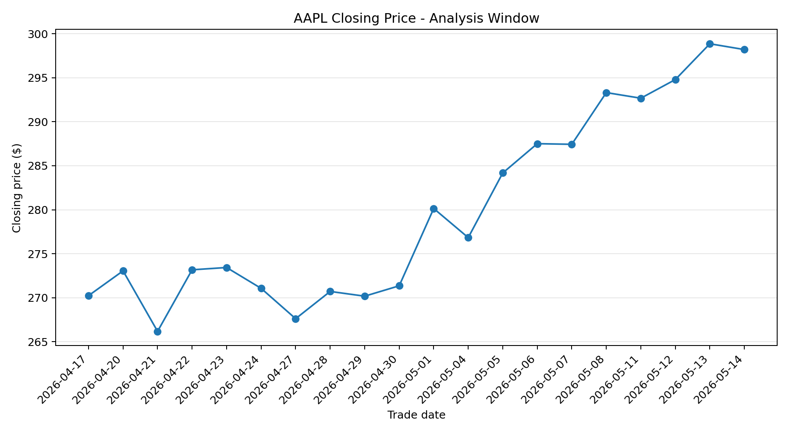
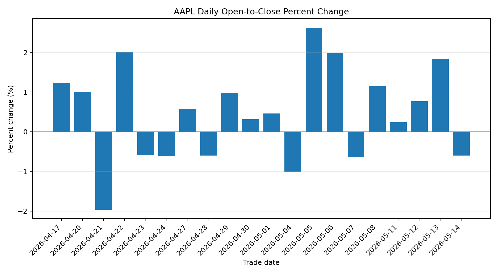
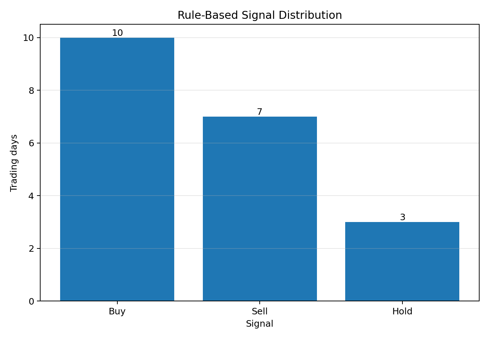
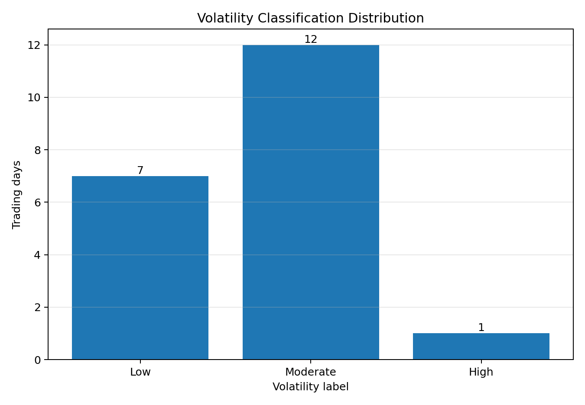

# AAPL Financial Analytics Pipeline

An end-to-end Python and SQLite workflow that retrieves or loads Apple Inc. (`AAPL`) daily market data, validates nested JSON, calculates price and volatility metrics, applies transparent rule-based classifications, stores the results in SQLite, and runs analytical SQL queries.

> The Buy/Sell/Hold labels describe same-day market behavior. They are not forecasts or investment recommendations.

## Quick links

- [Portfolio report](report/aapl_financial_analytics_report.pdf)
- [Python pipeline](src/aapl_financial_pipeline.py)
- [Chart generator](src/generate_charts.py)
- [Database schema](sql/schema.sql)
- [Analytical SQL queries](sql/analytics_queries.sql)
- [Sample SQLite database](database/aapl_stock_analysis.db)

## Project highlights

- Integrated the Alpha Vantage daily time-series API with validation for HTTP, JSON, rate-limit, and missing-field errors.
- Converted nested JSON records into typed analytical fields, including daily price change, percent change, intraday range, and range percentage.
- Applied interpretable movement, volatility, and signal rules across 20 recent trading days.
- Prevented duplicate symbol-date records using a composite SQLite primary key and upsert logic.
- Created reusable SQL queries for signal distribution, average return by signal, highest-volatility day, high-volatility records, and average closing price.
- Added an offline JSON option so the full pipeline can be reproduced without exposing an API key.

## Results from the included sample

The repository includes a saved response covering **20 AAPL trading days from April 17, 2026 through May 14, 2026**.

| Metric | Result |
|---|---:|
| Buy classifications | 10 |
| Sell classifications | 7 |
| Hold classifications | 3 |
| Low-volatility days | 7 |
| Moderate-volatility days | 12 |
| High-volatility days | 1 |
| Average closing price | $280.05 |
| Highest-volatility day | May 1, 2026 (3.17%) |

## Visuals

### Closing-price trend


### Daily open-to-close percent change


### Rule-based signal distribution


### Volatility classification distribution


## Business rules

| Rule | Classification |
|---|---|
| Percent change > 0.5% | Positive movement |
| Percent change < -0.5% | Negative movement |
| Percent change between -0.5% and 0.5% | Neutral movement |
| Daily range < 1.5% of opening price | Low volatility |
| Daily range from 1.5% through 3.0% | Moderate volatility |
| Daily range > 3.0% | High volatility |
| High volatility | Hold override |
| Positive movement and volatility not High | Buy |
| Negative movement and volatility not High | Sell |
| Neutral movement | Hold |

## Repository structure

```text
aapl-financial-analytics-pipeline/
├── assets/                 # Portfolio charts
├── data/                   # Saved sample API response
├── database/               # Reproducible SQLite output
├── report/                 # Portfolio report
├── sql/                    # Schema and analytical queries
├── src/                    # Python pipeline and chart generation
├── .env.example            # API-key configuration template
├── .gitignore
├── LICENSE
├── README.md
└── requirements.txt
```

## Run locally

### 1. Create and activate a virtual environment

```bash
python -m venv .venv
source .venv/bin/activate
```

On Windows PowerShell:

```powershell
.venv\Scripts\Activate.ps1
```

### 2. Install dependencies

```bash
pip install -r requirements.txt
```

### 3. Reproduce the included analysis without an API key

```bash
python src/aapl_financial_pipeline.py \
  --input-json data/sample_aapl_daily.json \
  --database database/aapl_stock_analysis.db \
  --limit 20
```

### 4. Generate the charts

```bash
python src/generate_charts.py \
  --database database/aapl_stock_analysis.db \
  --output-dir assets \
  --symbol AAPL
```

### 5. Run with fresh Alpha Vantage data

Set your key locally. Never commit it.

```bash
export ALPHA_VANTAGE_API_KEY="your_key_here"
python src/aapl_financial_pipeline.py --symbol AAPL --limit 20
```

## Limitations

- The classifications use the same day's open, high, low, and close; they do not predict the next trading day.
- Thresholds are transparent business rules rather than statistically optimized trading rules.
- The sample covers only 20 trading days and one company.
- The system excludes fundamentals, earnings, news, macroeconomic conditions, transaction costs, and portfolio constraints.
- API availability and rate limits can affect live execution.

## Security

The repository does not contain a real API key. Use `.env.example` only as a template and store your actual key outside version control.
